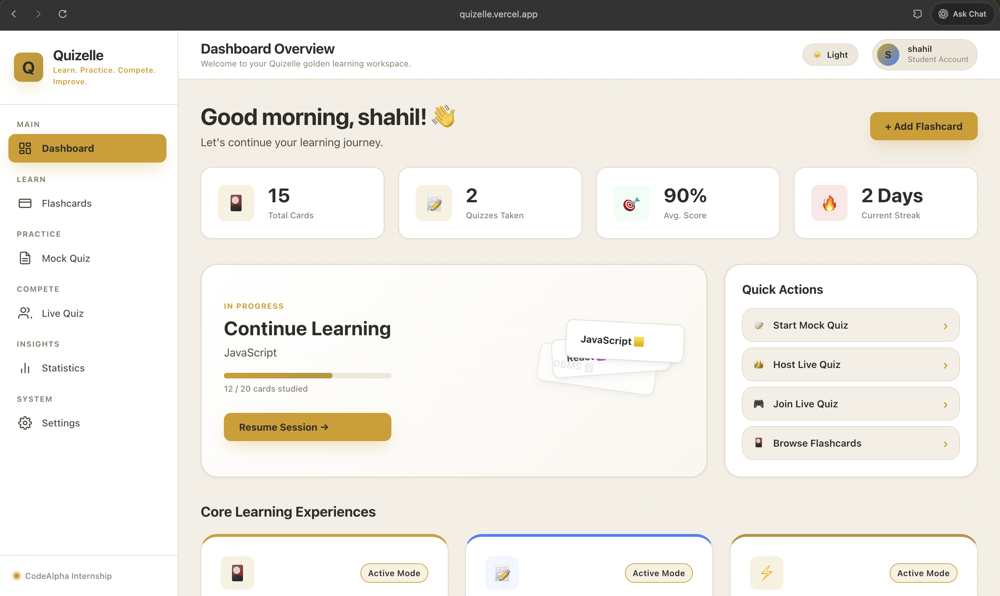
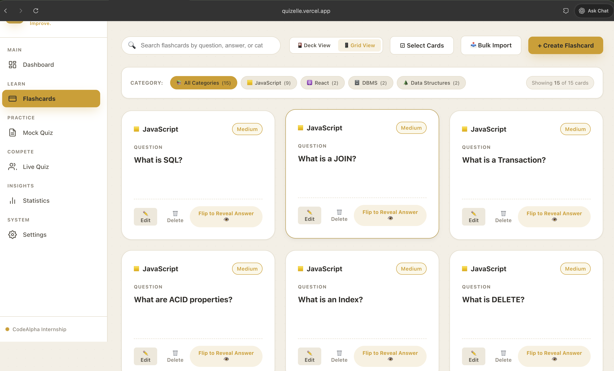
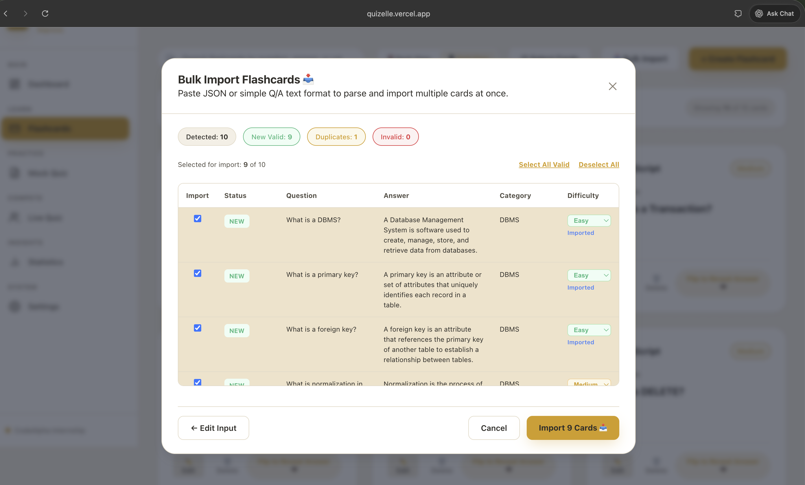
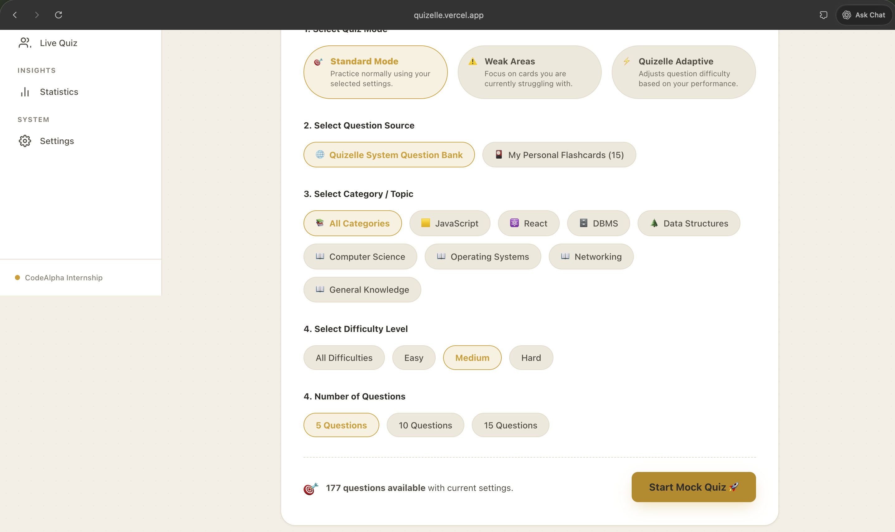
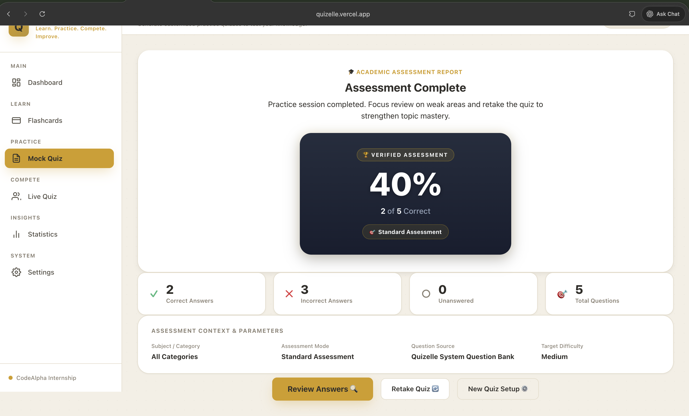
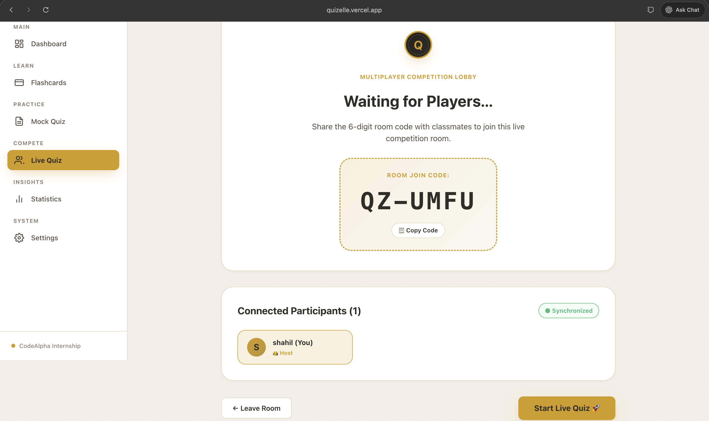

# Quizelle

### Learn. Practice. Compete. Improve.

[](https://react.dev/)
[](https://vitejs.dev/)
[](https://firebase.google.com/)
[](https://eslint.org/)
[](LICENSE)

**Quizelle** is a modern, high-performance web platform designed for technical flashcard mastery, adaptive self-assessment, and real-time competitive multiplayer quizzes. Built with **React 19**, **Vite**, and **Firebase Realtime Database**, Quizelle combines a tactile 3D study interface with a local heuristic difficulty engine, smart multiple-choice distractor generation, Bayesian-smoothed performance tracking, and an adaptive quiz algorithm.

---

### 📌 Quick Links

> 📦 **GitHub Repository:** [https://github.com/sushankar4041/CodeAlpha_QuizGenerator](https://github.com/sushankar4041/CodeAlpha_QuizGenerator)
> 🌐 **Live Demo:** *[Add Deployed Vercel URL]*
> 📸 **Screenshots:** [Jump to Screenshots](#-screenshots)

---

## 📸 Screenshots

*(To add your own screenshots, place PNG images into the [`docs/screenshots/`](docs/screenshots/) directory as described in [`docs/screenshots/README.md`](docs/screenshots/README.md).)*

| Dashboard Overview | Flashcard Study Deck |
| :---: | :---: |
|  |  |
| *Study activity, streaks & metrics* | *Interactive 3D Y-axis flip cards & filter chips* |

| Bulk Flashcard Importer | Adaptive Mock Quiz Session |
| :---: | :---: |
|  |  |
| *JSON / Q&A text parser with duplicate check* | *Timer, progress indicator & smart distractors* |

| Academic Assessment Report | Multiplayer Live Quiz |
| :---: | :---: |
|  |  |
| *Score centerpiece, fraction & metrics breakdown* | *Realtime room creation & podium leaderboard* |

---

## ✨ Features

### 📚 Tactile Flashcard Learning Engine
- **Interactive 3D Y-Axis Card Flip**: Visual card animation for revealing answers and testing recall.
- **Categorization & Filtering**: Organize cards by technical subjects (*JavaScript, React, DBMS, Data Structures, Networking, Operating Systems, Computer Science*).
- **Study Feedback**: Mark cards post-reveal as `✓ Got It` or `⚠️ Needs Review` to track study progress.
- **Full CRUD Management**: Create, edit, and delete single flashcards with immediate persistence.

### 📥 Bulk Flashcard Importer
- **Dual Format Support**: Parse both structured **JSON arrays** and raw **Q/A text formats** (*"Q: What is TCP? / A: Transmission Control Protocol"*).
- **Interactive Pre-Import Preview**: Preview parsed flashcards before committing to storage.
- **Deduplication Engine**: Automatically flags duplicate questions against existing flashcard collections.
- **Graceful Fallbacks**: Assigns default categories and initial difficulties for underspecified input.

### 🧠 Local Heuristic Initial Difficulty Engine
- **Pure Local Estimator**: Evaluates flashcards offline without external network APIs or AI dependencies.
- **Multi-Factor Text Analysis**: Analyzes question complexity, answer length, technical vocabulary density, recall vs. analytical phrasing, and multi-part questions.
- **Initial Classification**: Assigns initial difficulty levels (`Easy`, `Medium`, `Hard`) with explanatory confidence reasoning.

### 🎯 Smart Mock Quiz & Distractor Generator
- **4-Tier Distractor Hierarchy**:
  1. *Tier 1*: Explicit user-provided distractors.
  2. *Tier 2*: Related flashcards in the user's collection (matched by category & keyword similarity).
  3. *Tier 3*: Category pool candidates.
  4. *Tier 4*: Global collection fallbacks.
- **Randomized Option Shuffling**: Fisher-Yates option placement prevents positional bias.

### 📈 Personalized Difficulty & Performance Tracking
- **Attempt History Tracking**: Tracks total attempts, correct count, and incorrect count per card (`difficultyStats`).
- **Bayesian-Smoothed Accuracy**: Computes personalized difficulty (`personalizedDifficulty`) using Bayesian smoothing:
  $$\text{Smoothed Accuracy} = \frac{\text{Correct} + 1.0}{\text{Attempts} + 2.0}$$
- **Confidence Calibration**: Categorizes confidence state (`insufficient`, `emerging`, `established`).

### ⚡ Quizelle Adaptive Quiz Engine
Choose between three tailored quiz execution modes:
1. **Standard Mode**: Practice using fixed user-selected category, difficulty, and question count settings.
2. **Weak Areas Mode**: Automatically targets cards where the user is struggling (`personalizedDifficulty === 'Hard'` or accuracy $< 75\%$).
3. **Quizelle Adaptive Mode**: Dynamically balances candidate questions (~50% Hard/struggling cards, ~30% Medium/developing cards, and ~20% Easy/mastered cards for reinforcement).

### 🎴 Selected Flashcards & Batch Actions
- **Multi-Card Selection Mode**: Select individual cards or use `Select All Visible` to operate strictly on currently filtered/searched cards.
- **Batch Deletion**: Delete multiple flashcards in a single atomic action with a modal confirmation safeguard.
- **Selected-Card Quiz Pool (`📝 Quiz Selected`)**: Launch quizzes restricted **ONLY** to selected flashcard IDs across Standard, Weak Areas, and Adaptive modes.

### 🏆 Academic Assessment Results Report
- **Achievement Score Centerpiece**: Dark charcoal card with brushed gold border, prominent score percentage (`86%`), score fraction (`12 / 14 Correct`), and verified assessment badge.
- **Metrics Breakdown Grid**: Live counts for `✓ Correct Answers`, `✕ Incorrect Answers`, `○ Unanswered`, and `🎯 Total Questions`.
- **Assessment Context Card**: Displays subject category, quiz mode, question source, and target difficulty.

### 🌐 Multiplayer Live Quiz (Realtime Database)
- **Room Creation & Joining**: Host live quizzes with 6-digit room codes backed by **Firebase Realtime Database**.
- **Realtime Host Control**: Host manages player lobbies and triggers live question progression.
- **Live Podium & Leaderboard**: Realtime score sync and instant end-of-quiz podium rankings.

### 🔥 Learning Activity & Streak Tracker
- Logs study dates to `localStorage` and maintains consecutive daily learning streak counts.

---

## 📋 Feature Matrix

| Module / Feature | Offline Capable | Data Source | Status |
| :--- | :---: | :---: | :---: |
| **Flashcards CRUD & Study Deck** | Yes | `localStorage` | ✅ Complete |
| **Bulk Flashcard Importer** | Yes | Client-side Parser | ✅ Complete |
| **Heuristic Difficulty Estimator** | Yes | Deterministic Engine | ✅ Complete |
| **Smart Distractor Generation** | Yes | 4-Tier Local Pipeline | ✅ Complete |
| **Personalized Performance Tracking** | Yes | Bayesian Smoothing | ✅ Complete |
| **Standard Mock Quiz Mode** | Yes | Local / System Bank | ✅ Complete |
| **Weak Areas Quiz Mode** | Yes | Performance Stats | ✅ Complete |
| **Quizelle Adaptive Engine** | Yes | Weighted Distribution | ✅ Complete |
| **Selected Flashcard Quiz Pool** | Yes | Temporary Session Pool | ✅ Complete |
| **Batch Flashcard Actions** | Yes | Single-pass Transform | ✅ Complete |
| **Academic Assessment Results** | Yes | Runtime Result Object | ✅ Complete |
| **Multiplayer Live Quiz** | No (Network) | Firebase Realtime DB | ✅ Complete |

---

## 🧩 How Quizelle Works

```text
┌─────────────────────────────────────────────────────────┐
│              Create or Bulk Import Flashcards           │
└────────────────────────────┬────────────────────────────┘
                             │
                             ▼
┌─────────────────────────────────────────────────────────┐
│     Estimate Initial Heuristic Difficulty (Easy/Med/Hard)│
└────────────────────────────┬────────────────────────────┘
                             │
                             ▼
┌─────────────────────────────────────────────────────────┐
│            Select Quiz Mode & Question Source           │
│         (Standard  |  Weak Areas  |  Adaptive)          │
└────────────────────────────┬────────────────────────────┘
                             │
                             ▼
┌─────────────────────────────────────────────────────────┐
│    Generate MCQ Questions & 4-Tier Smart Distractors    │
└────────────────────────────┬────────────────────────────┘
                             │
                             ▼
┌─────────────────────────────────────────────────────────┐
│             Active Mock / Live Quiz Session             │
└────────────────────────────┬────────────────────────────┘
                             │
                             ▼
┌─────────────────────────────────────────────────────────┐
│       Record Performance & Re-estimate Difficulty       │
│     (Bayesian Smoothed Accuracy & Attempt Stats)        │
└────────────────────────────┬────────────────────────────┘
                             │
                             ▼
┌─────────────────────────────────────────────────────────┐
│     Academic Assessment Report & Streak Update          │
└─────────────────────────────────────────────────────────┘
```

---

## 🏗 Architecture & Repository Structure

Quizelle is architected around decoupled React UI components, pure utility engines, and dedicated storage services.

```text
QuizGenerator/
├── index.html
├── package.json
├── vite.config.js
├── eslint.config.js
├── docs/
│   └── screenshots/
│       └── README.md
└── src/
    ├── main.jsx
    ├── App.jsx                       # Main application state, view routing & toasts
    ├── App.css                       # Complete CSS design system, themes & animations
    ├── index.css                     # Baseline CSS resets & typography
    ├── components/
    │   ├── BulkImportModal.jsx       # Bulk Flashcard Importer & preview table
    │   ├── CategoryFilter.jsx        # Horizontal category chip selector
    │   ├── Dashboard.jsx             # Main learner overview, metrics & quick actions
    │   ├── EmptyState.jsx            # Empty collection & search result fallback
    │   ├── Flashcard.jsx             # Tactile 3D Y-axis flip card component
    │   ├── FlashcardForm.jsx         # Single flashcard create/edit modal
    │   ├── FlashcardList.jsx         # Flashcard collection view & batch action toolbar
    │   ├── Header.jsx                # Header bar, theme switcher & profile pill
    │   ├── LiveQuiz.jsx              # Live Quiz container & view manager
    │   ├── LiveQuizLobby.jsx         # Realtime player lobby & host controls
    │   ├── LiveQuizResults.jsx       # Live Quiz podium & final rankings
    │   ├── LiveQuizSession.jsx       # Realtime quiz question renderer
    │   ├── MockQuiz.jsx              # Mock Quiz session state controller
    │   ├── MockQuizConfig.jsx        # Quiz configuration, mode & source selector
    │   ├── MockQuizResults.jsx       # Academic Assessment Results report
    │   ├── MockQuizReview.jsx        # Question-by-question answer review screen
    │   ├── MockQuizSession.jsx       # Active MCQ quiz question session
    │   ├── ProgressBar.jsx           # Animated linear progress bar
    │   ├── QuizControls.jsx          # Session navigation & submit buttons
    │   ├── Settings.jsx              # Profile, preference & data reset settings
    │   ├── Sidebar.jsx               # Main navigation sidebar
    │   ├── Statistics.jsx            # Historical statistics & category breakdown
    │   └── Toast.jsx                 # Toast notification container
    ├── data/
    │   ├── defaultFlashcards.js      # Seed flashcard dataset
    │   └── questions/                # Lazy-loaded category datasets (.json)
    │       ├── computer_science.json
    │       ├── data_structures.json
    │       ├── dbms.json
    │       ├── general.json
    │       ├── javascript.json
    │       ├── networking.json
    │       ├── operating_systems.json
    │       └── react.json
    ├── services/
    │   ├── firebase.js               # Firebase app initialization & Realtime DB ref
    │   ├── liveQuizService.js        # Firebase Realtime Database room CRUD & listeners
    │   ├── questionBankService.js    # Universal Question Bank API & dataset loader
    │   └── storage.js                # LocalStorage persistence layer & schema normalization
    └── utils/
        ├── adaptiveQuizUtils.js      # Pure adaptive selection engine (Weak Areas & Adaptive)
        ├── difficultyUtils.js        # Heuristic estimator & Bayesian performance tracker
        ├── flashcardImportUtils.js   # JSON & Q/A text parsers & duplicate detector
        ├── quizUtils.js              # MCQ generator & 4-tier distractor selector
        ├── statisticsUtils.js        # Learning streak & quiz history metrics
        └── validation.js             # Form input validation helpers
```

---

## 🛠 Tech Stack

- **Frontend Core**: [React 19.2](https://react.dev/), [React DOM 19.2](https://react.dev/)
- **Build Tool & Bundler**: [Vite 8.2](https://vitejs.dev/)
- **Realtime Database**: [Firebase 12.17](https://firebase.google.com/) *(Realtime Database for Live Quiz)*
- **Language**: JavaScript (ES6+ Modules)
- **Styling**: Vanilla CSS3 using custom CSS design tokens, HSL color palettes, glassmorphism, and keyframe animations.
- **Code Quality**: [ESLint 10.8](https://eslint.org/) with `eslint-plugin-react-hooks` and `eslint-plugin-react-refresh`.

---

## 🚀 Getting Started

### Prerequisites
- **Node.js**: `v18.0.0` or higher
- **npm**: `v9.0.0` or higher

### Installation & Local Setup

1. **Clone the repository**:
   ```bash
   git clone https://github.com/sushankar4041/CodeAlpha_QuizGenerator.git
   cd CodeAlpha_QuizGenerator
   ```

2. **Install dependencies**:
   ```bash
   npm install
   ```

3. **Start the local development server**:
   ```bash
   npm run dev
   ```
   Open your browser and navigate to `http://localhost:5173`.

4. **Lint code**:
   ```bash
   npm run lint
   ```

5. **Build for production**:
   ```bash
   npm run build
   ```

6. **Preview production build locally**:
   ```bash
   npm run preview
   ```

---

## 🌐 Deployment

Quizelle is configured for seamless deployment on **Vercel** or any modern static web host.

### Deploying to Vercel
1. Push your code to GitHub.
2. Connect your GitHub repository in the [Vercel Dashboard](https://vercel.com).
3. Set the Framework Preset to **Vite**.
4. Configure Build Command: `npm run build` and Output Directory: `dist`.
5. *(Optional)* Add Firebase environment variables if using custom live multiplayer credentials:
   - `VITE_FIREBASE_API_KEY`
   - `VITE_FIREBASE_AUTH_DOMAIN`
   - `VITE_FIREBASE_DATABASE_URL`
   - `VITE_FIREBASE_PROJECT_ID`

---

## 📱 Android App

Quizelle is packaged as a native Android application using **Capacitor**.

> 📱 **Download APK:** [Quizelle-v1.0.apk](Quizelle-v1.0.apk)

### Installation Instructions:
1. Download `Quizelle-v1.0.apk` to your Android device.
2. Enable **"Install Unknown Apps"** or **"Allow from this source"** in your Android device settings.
3. Open the downloaded file and tap **Install** to launch Quizelle.

---

## 💾 Data Persistence Schema

User data is stored client-side in the browser's `localStorage` under isolated key namespaces:

- `quiz_generator_flashcards`: Stores normalized flashcard array with `difficultyStats`, `personalizedDifficulty`, and `distractors`.
- `quiz_generator_history`: Stores completed quiz session results.
- `quiz_generator_learner_profile`: Stores learner profile (display name, avatar, target goal).
- `quiz_generator_preferences`: Stores user preferences (preferred difficulty, question count, theme).
- `quiz_generator_learning_activity`: Stores dates of completed learning activities for study streak calculation.

---

## ⚠️ Current Architectural Boundaries

- **Client-Side Persistence**: Flashcards and quiz history are saved locally per browser/device via `localStorage`.
- **Realtime Dependency**: Live Quiz multiplayer requires an active internet connection to communicate with Firebase Realtime Database.
- **Deterministic Heuristics**: Initial difficulty estimation and smart distractors use local deterministic algorithms without third-party AI cloud API overhead.

---

## 🗺 Product Roadmap

### Near Term
- [ ] Export flashcard collections to JSON file download.
- [ ] Filter flashcards by personalized difficulty level (`Your: Hard`).
- [ ] Additional default category question bank expansion.

### Future Potential
- [ ] Cloud account synchronization across devices.
- [ ] Server-side competitive tournament rooms.
- [ ] Rich performance trend graphs over multi-week spans.

---

## 🧪 Verification & Quality Control

The project includes built-in verification scripts and strict quality checks:

```bash
# Code Quality Check
npm run lint

# Production Build Validation
npm run build

# Whitespace & Diff Check
git diff --check
```

---

## 🎨 Design Philosophy

Quizelle follows a **refined academic design system**:
- **Palette**: Deep charcoal surfaces (`#0f172a`, `#1e293b`), brushed gold accents (`#eab308`), cream/ivory cards, and clear semantic feedback colors.
- **Typography**: Modern sans-serif stack (`Inter`, system UI) with tabular numbers for timers and score percentages.
- **Accessibility**: Full keyboard navigation, `aria-pressed` states, accessible contrast ratios, and visible focus rings.

---

## 🤝 Contributing

1. Fork the repository.
2. Create your feature branch (`git checkout -b feature/AmazingFeature`).
3. Commit your changes (`git commit -m 'Add some AmazingFeature'`).
4. Run code verification (`npm run lint && npm run build`).
5. Push to the branch (`git push origin feature/AmazingFeature`).
6. Open a Pull Request.

---

## 📜 License

This project is licensed under the **MIT License**.

---

## 👨‍💻 Author

**Quizelle / CodeAlpha QuizGenerator Team**
GitHub: [sushankar4041](https://github.com/sushankar4041)
Repository: [CodeAlpha_QuizGenerator](https://github.com/sushankar4041/CodeAlpha_QuizGenerator)
